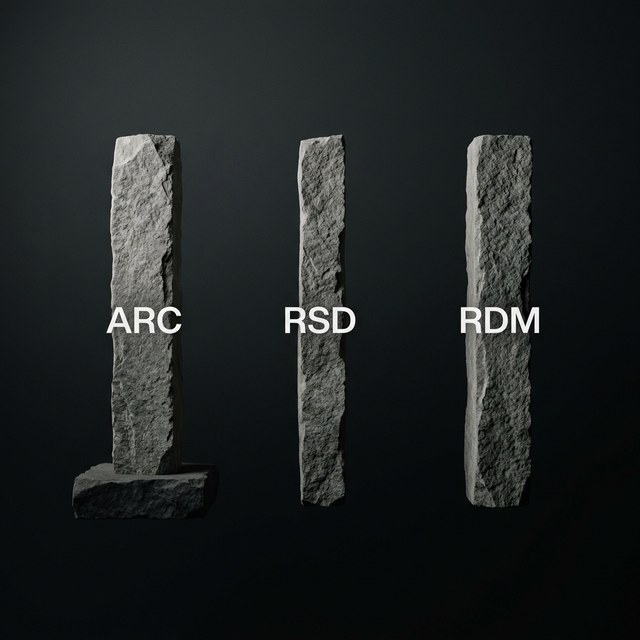
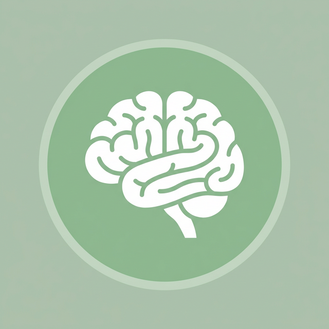
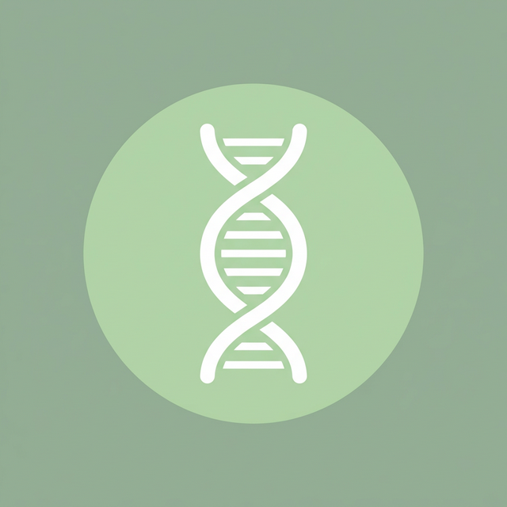
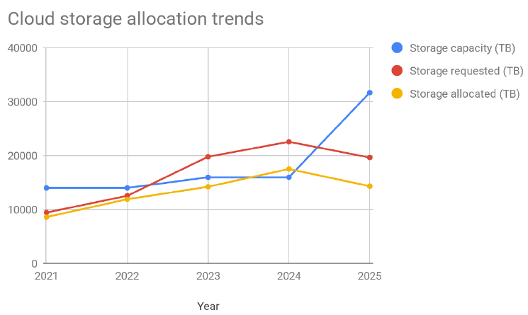
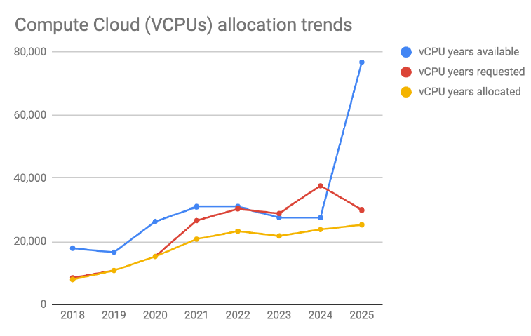
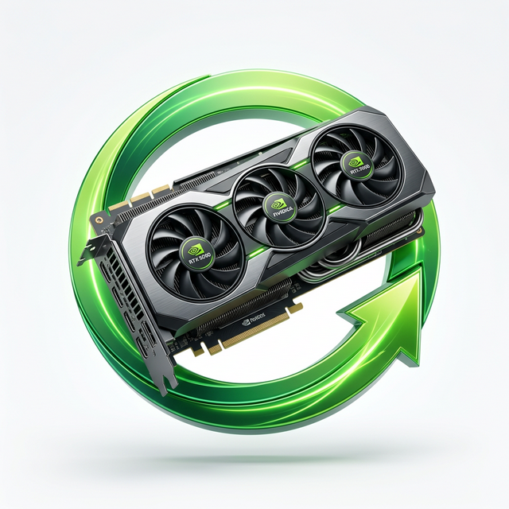
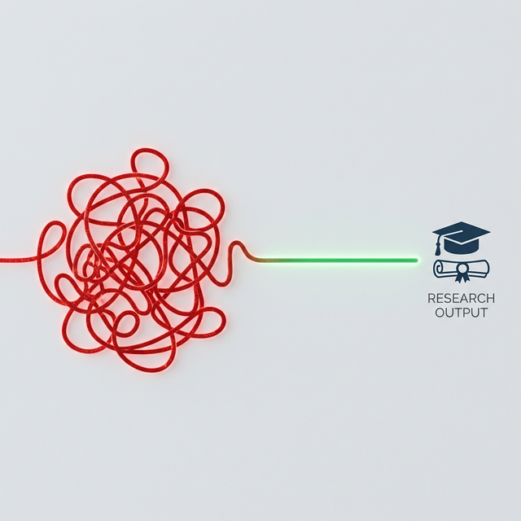

::: notes
Good morning, everyone. In our previous RDA plenary, we tackled the challenge of defining what the 'uptake' of Digital Research Infrastructure actually looks like, and how we can measure it across researchers, support staff, and policymakers. Today, I want to take to share with you how we are grounding these theoretical questions in Canada’s evolving DRI ecosystem. I work with the Digital Research Alliance of Canada, and our experience shows that measuring uptake is no longer just about counting server hours or data deposits. It is about measuring integration. And I personally believe that is the real challenge. 
:::

## DRI Uptake in the Real World Reamins a Challengue 

::: columns
::: {.column style="width: 50%;" layout-valign="center"}
#### RDA Pillars of "Uptake"
- Use
- Integration
- Collaboration
:::

::: {.column style="width: 50%; text-align: center; font-size: 70%"}
#### The reality: Fragmented ecosystem
{height="300"}

Fragmented workflows, rigid silos, and queuing delays
:::
:::

::: notes
"To understand uptake, we must first embrace a critical paradigm shift. While we could agree in certain principles when refering to DRI: USE, Inegration and Collaboration, historically, DRI uptake has been measured in silos: Advanced Research Computing over here, Research Software over there, and, specially, Research Data Management treated as an administrative afterthought at the end of a project, and considered many times just aption or an add-on. We all agree that we cannot operate that way anymore."
:::

## The Paradigm Shift: Beyond Isolated Pillars

::: {.r-stack}
{width="600"}
:::

::: {.callout-tip}
## Data Curation: The Essential Connective Tissue
Connecting ARC, RSD, and RDM into a functional ecosystem.
:::

::: notes
"We can argue then that uptake emphasizes seamlessly connecting these aspects of research, more like a relay towers that only fulfill their purpose when they communicate with each other. In Canada, we are treating these components like a national relay network. RDM, Compute, and Software must maintain a continuous line of sight. When a researcher uses advanced compute for high-performance processing, we hope that seamless data management allows them to handle petabyte-scale datasets without having a stroke. I think we are not there yet, but we are getting there. And we are also building different environments, like RAIDs. In this sense, we may say that DRI uptake occurs when a researcher doesn't experience friction moving between these nodes."
:::

## DRI in Action: Canadian Cases

::: columns
::: {.column style="width: 33.3%; font-size: 50%; text-align: left;"}
{width="100"}

### [CBRAIN](https://cbrain.ca/) (Neuroscience)

**Infrastructure Model:** Web-based distributed platform connecting to Alliance resources.

**The RDM Solution:** Federated data spaces that create reproducible workflows. Links input data and analytic tools without manual downloading.
:::

::: {.column style="width: 33.3%; font-size: 50%; text-align: left;"}
{width="100"}

### [Pan-Canadian Genome Library](https://genomelibrary.ca/) (Health)

**Infrastructure Model:** National secure data storage and harmonization.

**The RDM Solution:** Unifying 100,000+ genomes (20PB of data) into a long-term archive, ending the era of stranded data at the end of isolated grants.
:::

::: {.column style="width: 33.3%; font-size: 50%; text-align: left;"}
{width="100"}

### Colibri Initiative (HSS)

**Infrastructure Model:** Accessible, secure open-source cloud Virtual Machines.

**The RDM Solution:** Providing a secure, non-commercial collaborative environment to manage qualitative, identifiable Humanities & Social Sciences data.
:::
:::

::: notes
"These aren't just theoretical models; but we can say they are operational realities. In Canada we have these tree examples, CBRAIN that links neuroscience research via a distributed platform. The Pan-Canadian Genome Library that is unifying enormous amounts of data, over 20 petabytesinto a sustainable archiv accesible for averyone. And the Colibri Initiative, that provides the Humanities and Social Sciences with secure, non-commercial collaborative environments. So, in this cases, we see an effective infrastructure that isn't just about raw compute power; but also it's about providing secure, tailored data stewardship that builds trust across every discipline. Also, we may say that, in this cases for example, we can refer to 'uptake' in terms of how seamlessly these national resources are used by researchers across institutional borders."
:::
## The Reality of Demand: RAC 2025 Metrics

::: columns
::: {.column style="width: 33.3%; text-align: center;"}

:::

::: {.column style="width: 33.3%; text-align: center;"}

:::

::: {.column style="width: 33.3%; text-align: center;"}

:::
:::

::: {style="font-size: 0.6em; margin-top: 20px; text-align: left; padding: 20px; background-color: rgba(52, 152, 219, 0.1); border-radius: 10px;"}
- **Rising Demand**: RAC 2025 shows a significant upward trend in resource requests.
- **The Hidden Gap**: While capacity is growing, much of it goes unused or misused due to gaps in RDM competence.
- **Critical Uptake Metric**: True adoption depends on **researcher skills** to manage petabytes of data, not just raw hardware availability.
:::

::: notes
"Now, this is few quantitative evidence driving this need for interconnection in our country. The 2025 Resource Allocation Competition (RAC) from the Alliance, shows an increasin thrend in the demand for resources. Our national ARC platform is now serving over 20,000 researchers, including more than 5,800 faculty members across Canadian institutionsLook, with the investments done last year, we finally are able to surpass the capacity (which is the blue line) compared to the request. But these charts hide another uncomfortable truth that many of us are aware of. Much of that required space goes unused or is misused simply because of the widespread lack of competence in research data management among researchers. But here is the critical point: hardware is finite. We cannot outspend on pure hardware volume. So, when resources are this competitive, data optimization becomes imperative.We know that it is not just about hard drives to store petabytes of data, but also about strategies to manage them properly, ensure their documentation, and reduce waste. So this is another challenge if one intends to measure DRI uptake: to what extent do researchers have the skills to effectively manage these resources. This is something that, to my knowledge, it is still unkown in Canada and must be an active are of development. So, it is not about who or how many users a system have but also about what is the quality of the use and competence. "
:::

## Reclaiming Scarce Resources: [Calcul Québec Case](https://www.youtube.com/watch?v=2iBM3q-eiaI&list=PL2jE_DQZemnXBYSEzzxxm86dbgVCXalPi&index=9)

::: {.text-center}
[**$90,000 Saved**]{style="font-size: 2em; color: #27ae60;"}

[**125 Interventions**]{style="font-size: 1.5em;"}
:::

:::: {.columns}
::: {.column style="width: 20%;"}
{width="150"}
:::
::: {.column style="width: 80%; font-size: 80%; text-align: left;"}
- Analysts monitored unoptimized jobs.
- Target interventions corrected workflows.
- Prevented compute waste on constrained resources.
:::
::::

::: notes
"and when we fail to integrate RDM and software support precious infrastructure is wasted. Here is an example provided by Calcul Qu[ebec in the last DRI connect in Canada, where they explained that minitored unoptimized jobs and made 125 targeted interventions to help researchers correct their workflows. This was transformed in savings of $90,000 worth of compute waste. This example showcases that it is not precicely the case that researchers love to waste resources; byt that they simply lack competence to optimize their workflows. Again, DRI uptake must measure this aspect of competence."
:::

## DRI Uptake: Eradicating Friction

:::: {.columns}
::: {.column style="width: 50%;"}
{width="300"}
:::
::: {.column style="width: 50%; font-size: 80%; text-align: left;"}
- Move beyond login hours and gigabytes.
- Infrastructure as an invisible part of the research process.
- Integrated environments feed into advanced compute.
:::
::::

> "Experience is the ultimate metric of uptake."

::: notes
"This brings us to a key message of 'Integration of research workflows'. We cannot measure real DRI uptake just by counting login hours or total gigabytes stored. We need to also find out how well our infrastructure, policies qadn pracices benefit and removes technical friction for the researcher. When a researcher has to navigate complex command lines or read 400-page manuals just to manage their data, uptake stalls. But when we provide integrated environments to develop competencies, which are transformed into a more efficient and dynamic work environment, aspects like data management and curation feeds directly advanced compute without administrative burden. I think that at this point is when the tools the Alliance or other instituitions develop become an integral for the research process. We can say then that a frictionless experience is the ultimate metric of uptake."
:::

## The Connected Future: Canada's DRI Vision

:::: {.columns}
::: {.column style="width: 50%;"}
{width="700"}
:::
::: {.column style="width: 50%; font-size: 80%; text-align: left;"}
- **Hardware**: Scarce, high-value compute.
- **Curation**: Federated national data.
- **People**: Distributed skilled workforce.
- **Glue**: Persistent identifiers (RAiDs).
:::
::::

::: notes
"As we align with the RDA’s vision on driving DRI capacity and uptake, right now c=Canada is making several efforts to build a unified architecture known as the Canadian Research Data Platform. With this, we envisage to combine igh-value compute resources with our incredibly rich national data, and data management tools, all supported by a distributed workforce of skilled professionals around the country. We hope that in the near future, by using persistent identifiers like RAiDs to glue together projects, data, and computations, we can create a sustainable and sovereign ecosystem that could be the model for other countries. In this context, for us, measuring DRI uptake, will mean ensuring this interconnected machine works for every researcher in the country. Thank you."
:::
